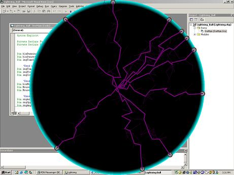



## Lightning Ball

### Description

Makes a cool Lightning Ball thing on the screen. Looks cool, see screen shot. If anyone wants to help me translate it into a Java Applet so i can put it on a Web Page, just leave a comment.
 
### More Info
 

             |
---                |---
**Submitted On**   |2005-02-01 15:53:30
**By**             |[Tim Heap](https://github.com/Planet-Source-Code/PSCIndex/blob/master/ByAuthor/tim-heap.md)
**Level**          |Advanced
**User Rating**    |4.7 (14 globes from 3 users)
**Compatibility**  |VB 5\.0, VB 6\.0
**Category**       |[Graphics](https://github.com/Planet-Source-Code/PSCIndex/blob/master/ByCategory/graphics__1-46.md)
**World**          |[Visual Basic](https://github.com/Planet-Source-Code/PSCIndex/blob/master/ByWorld/visual-basic.md)
**Archive File**   |[Lightning\_184938262005\.zip](https://github.com/Planet-Source-Code/tim-heap-lightning-ball__1-58747/archive/master.zip)

